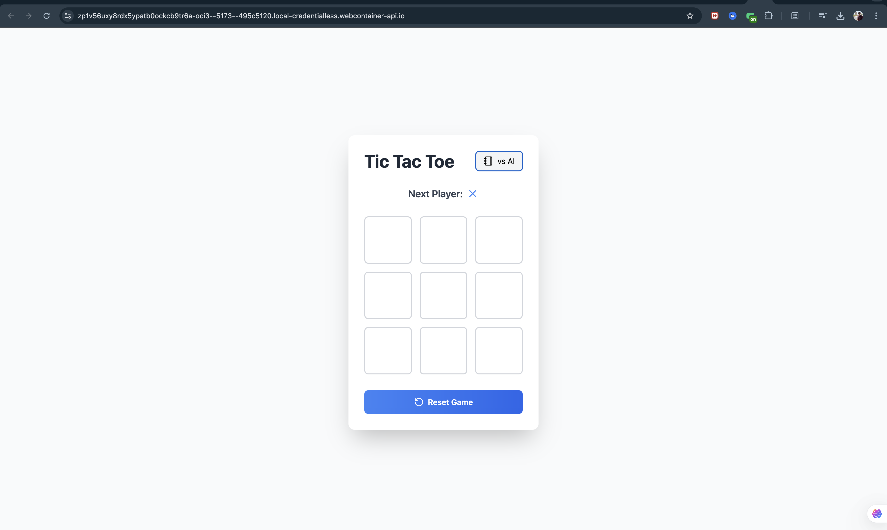

# Modern Tic Tac Toe Game

A beautiful, responsive Tic Tac Toe game built with React, TypeScript, and Tailwind CSS. Features both Player vs Player and Player vs AI modes with an unbeatable AI opponent using the Minimax algorithm.



## Features

- 🎮 Two game modes:
  - Player vs Player
  - Player vs AI (unbeatable)
- 🎨 Modern, responsive design with smooth animations
- 🤖 Intelligent AI using Minimax algorithm
- 🔄 Automatic game reset on completion
- 💅 Beautiful UI with Tailwind CSS
- 🎯 TypeScript for type safety
- 📱 Fully responsive for all devices

## Project Structure

```
tic-tac-toe/
├── src/                    # Source code
│   ├── App.tsx            # Main application component
│   ├── main.tsx           # Application entry point
│   ├── index.css          # Global styles
│   └── vite-env.d.ts      # TypeScript declarations
├── public/                 # Static assets
├── nginx.conf             # Nginx configuration
├── Dockerfile             # Docker configuration
├── .dockerignore          # Docker ignore file
├── .gitignore             # Git ignore file
├── index.html             # HTML entry point
├── package.json           # Project dependencies
├── postcss.config.js      # PostCSS configuration
├── tailwind.config.js     # Tailwind CSS configuration
├── tsconfig.json          # TypeScript configuration
├── tsconfig.node.json     # Node-specific TS config
└── vite.config.ts         # Vite configuration
```

## Tech Stack

- React 18
- TypeScript
- Tailwind CSS
- Vite
- Lucide React (for icons)

## Getting Started

### Prerequisites

- Node.js (v18 or higher)
- npm (v9 or higher)

### Installation

1. Clone the repository:
   ```bash
   git clone https://github.com/yourusername/tic-tac-toe.git
   cd tic-tac-toe
   ```

2. Install dependencies:
   ```bash
   npm install
   ```

3. Start the development server:
   ```bash
   npm run dev
   ```

4. Open your browser and visit `http://localhost:5173`

### Building for Production

To create a production build:

```bash
npm run build
```

The built files will be in the `dist` directory.

### Docker Deployment

1. Build the Docker image:
   ```bash
   docker build -t tic-tac-toe .
   ```

2. Run the container:
   ```bash
   docker run -p 80:80 tic-tac-toe
   ```

#### Custom Port Configuration

If port 80 is already in use, you can specify a different port:

1. Using a different port when running the container:
   ```bash
   docker run -e PORT=8080 -p 8080:8080 tic-tac-toe
   ```

2. Or map the container's port 80 to a different host port:
   ```bash
   docker run -p 8080:80 tic-tac-toe
   ```

## How to Play

1. Choose your game mode (Player vs Player or Player vs AI) using the toggle button
2. In Player vs Player mode:
   - Players take turns clicking on the board
   - X goes first, followed by O
3. In Player vs AI mode:
   - You play as X
   - The AI plays as O
   - The AI is unbeatable and uses the Minimax algorithm
4. The game automatically resets when:
   - A player wins
   - The game ends in a draw

## AI Implementation Details

The AI in this game uses the Minimax algorithm to create an unbeatable opponent. You can find the implementation in `src/App.tsx`.

### How the AI Works

The Minimax algorithm works by:
1. Simulating all possible moves
2. Evaluating each move's outcome
3. Choosing the move that maximizes the AI's chances of winning while minimizing the player's chances

Key functions in the implementation:

1. `minimax(squares: Board, depth: number, isMaximizing: boolean): number`
   - Located in `src/App.tsx`
   - This is the core algorithm that recursively evaluates all possible moves
   - Parameters:
     - `squares`: Current board state
     - `depth`: Current depth in the game tree
     - `isMaximizing`: Whether it's maximizing (AI) or minimizing (player) turn
   - Returns a score for the current board state

2. `getBestMove(squares: Board): number`
   - Uses the minimax algorithm to determine the optimal move
   - Returns the index of the best possible move for the AI

3. `handleAIMove()`
   - Triggers the AI move after a short delay
   - Implements the chosen move on the game board

### Scoring System

The AI evaluates positions with the following scoring:
- Win for AI (O): +10 - depth
- Win for Player (X): depth - 10
- Draw: 0

The depth is subtracted/added to prefer winning in fewer moves and delaying losing as long as possible.

### Code Structure

```typescript
// Core minimax algorithm
const minimax = (squares: Board, depth: number, isMaximizing: boolean): number => {
  const winner = checkWinner(squares);
  if (winner === 'O') return 10 - depth;      // AI wins
  if (winner === 'X') return depth - 10;      // Player wins
  if (getAvailableMoves(squares).length === 0) return 0;  // Draw

  const availableMoves = getAvailableMoves(squares);
  let bestScore = isMaximizing ? -Infinity : Infinity;

  for (const move of availableMoves) {
    squares[move] = isMaximizing ? 'O' : 'X';
    const score = minimax(squares, depth + 1, !isMaximizing);
    squares[move] = null;
    bestScore = isMaximizing ? 
      Math.max(score, bestScore) : 
      Math.min(score, bestScore);
  }

  return bestScore;
};
```

This implementation makes the AI unbeatable - the best a player can achieve against it is a draw.

## Contributing

Contributions are welcome! Please feel free to submit a Pull Request.

## License

This project is licensed under the MIT License - see the LICENSE file for details.